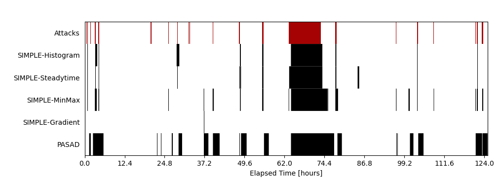
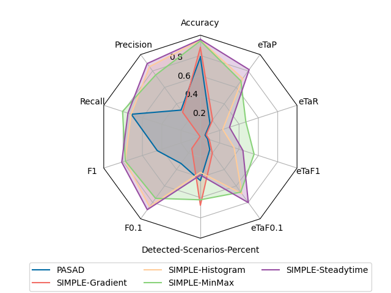

# IPAL - Evaluate

This repository is part of [IPAL](https://github.com/fkie-cad/ipal)  - an Industrial Protocol Abstraction Layer. IPAL aims to establish an abstract representation of industrial network traffic for subsequent unified and protocol-independent industrial intrusion detection. IPAL consists of a [transcriber](https://github.com/fkie-cad/ipal_transcriber) to automatically translate industrial traffic into the IPAL representation, an [IDS Framework](https://github.com/fkie-cad/ipal_ids_framework) implementing various industrial intrusion detection systems (IIDSs), and a collection of evaluation [datasets](https://github.com/fkie-cad/ipal_datasets). For details about IPAL, please refer to our publications listed down below.

Industrial systems are increasingly threatened by cyber attacks with potentially disastrous consequences. To counter such attacks, industrial intrusion detection systems strive to uncover even the most sophisticated breaches in a timely manner. Due to its criticality for society, this fast-growing field attracts researchers from diverse backgrounds, resulting in huge momentum and diversity of contributions. Consequently, due to a lack of standard interfaces, standard tools for evaluating IDSs do not exist. Based on IPAL - a common message format that decouples IIDSs from domain-specific communication protocols, the `ipa-evalute` tool serves to address this problem by combining a variety of commonly used performance metrics into a single solution for scientific evaluation.

This repository contains the ``ipal-evaluate`` tool along with several useful scripts which facilitate easy and unified evaluations in industrial IDS research.

###### Implemented Metrics

The evaluation framework contains implementations of the following metrics. Note that we distinguish between metric types that operate on point-based (in arbitrary order) and time-series (temporarily ordered) data. For a detailed description of the metrics, please refer to our [publication](#publications) "Evaluations in Industrial Intrusion Detection Research".

| Metric (Synonyms) | Type | Formula | Description | Better Score | value range |
| --- | --- | --- | --- | --- | --- | 
| True Negatives (TN) | Point-based | -- | Number of benign entries classified as benign. | high | $[0, +\infty)$ | 
| True Positives (TP) | Point-based | -- | Number of attack entries detected by the IIDS. | high | $[0, +\infty)$ | 
| False Negatives (FN) | Point-based | -- | Number of attack entries not detected by the IIDS. | low | $[0, +\infty)$ |
| False Positives (FP) | Point-based | -- | Number of benign entries alerted by the IIDS. | low | $[0, +\infty)$ | 
| Accuracy (Rand Index) | Point-based | $\frac{\text{tp} + \text{tn}}{\text{tp} + \text{tn} + \text{fp} + \text{fn}}$ | Accuracy captures the overall proportion of correct classifications. The higher the accuracy score is, the more reliable the predictions of the IIDS are. Synonyms: Rand Index. | high | $[0,1]$ |
| Precision (PPV, Confidence) | Point-based | $\frac{\text{tp}}{\text{tp} + \text{fp}}$ | Precision is the proportion of correct classifications among all positive classifications (entries classified as malicious). It captures the validness of positive classifications. Synonyms: PPV, Confidence. | high | $[0,1]$ | 
| Inverse-Precision (NPV, TNA) | Point-based | $\frac{\text{tn}}{\text{tn} + \text{fn}}$ | In contrast to precision, inverse precision is the proportion of benign entries correctly classified as benign. Synonyms: NPV, TNA. | high | $[0,1]$ | 
| Recall (TPR, Sensitivity, Hit Rate) | Point-based | $\frac{\text{tp}}{\text{tp} + \text{fn}}$ | Recall states how many malicious entries of the dataset are actually detected by an IIDS. It captures the completeness of positive classifications. Synonyms: TPR, Sensitivity, Hit Rate. | high | $[0,1]$ | 
| Inverse-Recall (TNR, Specificity, Selectivity) | Point-based | $\frac{\text{tn}}{\text{tn} + \text{fp}}$ | Inverse recall is the proportion of classifications as benign behavior that are correct. Synonyms: TNR, Specificity, Selectivity.  | high | $[0,1]$ | 
| Per-Scenario Recall| Point-based | $\{\frac{\text{tp}_i}{\text{tp}_i + \text{fn}_i}\ \|\  i \in \text{scenarios}\}$ | Recall measurement on a per-attack-scenario basis. | high | $[0,1]$ | 
| Fallout (FPR) | Point-based | $\frac{\text{fp}}{\text{fp} + \text{tn}}$ | Fallout calculates the fraction of false alarms across the dataset. Synonyms: FPR. | low | $[0,1]$ | 
| Missrate (FNR) | Point-based | $\frac{\text{fn}}{\text{fn} + \text{tp}}$ | Missrate measures the fraction of missed malicious entries. Synonyms: FNR. | low | $[0,1]$ |
| Informedness (Youden's J statistic) | Point-based | $\text{TPR} + \text{TNR} - 1$ | Informedness aggregates recall and inverse recall, measuring how informed the IIDS is, i.e. the completeness of both positive and negative classifications. Synonyms: Youden's J statistic. | high | $[-1,1]$ |
| Markedness | Point-based | $\text{PPV} + \text{NPV} - 1$ | Markedness aggregates precision and inverse precision, measuring the reliability of the IIDS, i.e. the validness of both positive and negative classifications. | high | $[-1,1]$ | 
| F-Score | Point-based | $(1 + \beta^2) \cdot \frac{\text{PPV} \cdot \text{TPR}}{(\beta^2 \cdot \text{PPV}) + \text{TPR}}$ | Usually, an inherent tradeoff between achieving a maximal number of detected attacks (recall) while reducing false positives (precision) exists. The F-score combines both design goals into a single metric. F1 is the harmonic mean between precision and recall. | high | $[0,1]$ |
| Matthews correlation coefficient (MCC, Phi coefficient) | Point-based | $\frac{\text{tp} \cdot \text{tn} + \text{fp} \cdot \text{fn}}{\sqrt{(\text{tp} + \text{fp})(\text{tp} + \text{fn})(\text{tn} + \text{fp})(\text{tn} + \text{fn})}}$ | Matthew's Correlation Coefficient measures the correlation between the IIDS' classification and the ground truth. Its main advantage over the F-score is that it is not affected by over-representation of either benign of malicious entries. Synonyms: Phi coefficient. | high | $[-1,1]$ | 
| Jaccard Index (Tanimoto Index) | Point-based | $\frac{\text{tp}}{\text{tp} + \text{fn} + \text{fp}}$ | The Jaccard index measures the similarity between the set of entries deemed to be malicious obtained from the classification and the one obtained from the ground truth. Synonyms: Tanimoto Index. | high | $[0,1]$ | 
| Jaccard Distance | Point-based | $1- \frac{\text{tp}}{\text{tp} + \text{fn} + \text{fp}}$ | The Jaccard distance is the complement to the Jaccard index, it measures the dissimilarity between the classification and the ground truth. | low | $[0,1]$ |
| Detected Scenarios | Time-aware | -- | Detected scenarios lists the attack scenarios detected by at least a single alarm. | -- | -- | 
| Detected Scenarios Percent | Time-aware | $\frac{\|\text{detected scenarios}\|}{\|\text{scenarios}\|} \cdot 100$ | Proportion of attack scenarios that were detected by the IIDS. | high | $[0,100]$ |
| Penalty Score (PS) | Time-aware | $\sum_{\alpha \in \alpha} \max(\text{len}(\alpha) - \text{len}(\text{overlap}), 0)$ where $\alpha$ is the set of alarms | Penalty Score (PS) is the length of detection results outside their overlap with attack scenarios (cf. [TABOR paper](https://doi.org/10.1145/3196494.3196546)). | low | $[0, +\infty)$  | 
| Detection Delay | Time-aware | $\sum_{a \in A} t_\alpha - t_a$ where $A$ is the set of anomalies (attack scenarios), $t_a$ the start timestamp of attack $a$ and $t_\alpha$ the start timestamp of the first overlapping alarm | The detection delay aggregates the time intervals between the start of an attack and the time of the first detection. | low | $[0, +\infty)$ | 
| True Positive Alarms (TPA) | Time-aware | -- | True positive alarms (TPA) counts the number of continuous alarms that overlap with at least a single attack. | high | $[0, \|\text{alarms}\|]$ | 
| False Positive Alarms (FPA) | Time-aware | -- | False positive alarms (FPA) counts the number of continuous alarms that do not overlap with any attack. | low | $[0, \|\text{alarms}\|]$  | 
| enhanced Time-aware Precision (eTaP) | Time-aware | $\sum_{p \in P}(\frac{s^d(p) + s^d(p) \cdot s^p(p)}{2}) \cdot w_p$ where $P$ is the set of predictions, $w_p$ the weight for prediction $p$, and $s^d$ and $s^p$ are detection and portion scores | [Hwang et al.](https://doi.org/10.1145/3477314.3507024) proposed their (enhanced) time series-aware variants for classical point-based metrics, i.e., precision, recall, and F1, addressing known issues when adopting point-based metrics for time series-aware evaluations. To replace precision, for instance, eTaP implements diminishing returns for long-lasting alarms. | high | $[0,1]$ | 
| enhanced Time-aware Recall (eTaR) | Time-aware | $\frac{1}{\|A\|} \sum_{a \in A}\frac{s^d(a) + s^d(a) \cdot s^p(a)}{2}$ where $A$ is the set of anomalies (attack scenarios), $s^d$ and $s^p$ are detection and portion scores | Similarly, while point-based recall weights long attacks as more important, the new time series-aware recall variant (eTaR) treats all consecutive attacks equally. | high | $[0,1]$ | 
| enhanced Time-aware F Score (eTaf) | Time-aware | $(1 + \beta^2) \cdot \frac{\text{eTaP} \cdot \text{etaR}}{(\beta^2 \cdot \text{eTaP}) \cdot \text{eTaR}}$ | The proposed eTaF score is defined in the same way as the regular F score but leverages the substitute eTaP and eTaR metrics. | high | $[0,1]$ |
| BATADAL Time to Detection (TTD) | Time-aware | $1 - \frac{1}{\|A\|} \sum_{1 \geq i \geq \|A\|}\frac{\text{TTD}_i}{\Delta t_i}$ where $A$ is the set of anomalies (attack scenarios), $\text{TTD}_i$ the time to detection for the $i$th anomaly and $\Delta t_i$ the duration of the $i$th anomaly | [BATADAL](https://doi.org/10.1061/(ASCE)WR.1943-5452.0000969) time-to-detection. Normalized time until an attack is detected. | high | $[0,1]$ | -- |
| BATADAL CLF (Classification Performance) | Time-aware | $\frac{\text{TPR} + \text{TNR}}{2}$ | BATADAL classification performance. Mean between TNR and TPR | high | $[0,1]$ |
| BATADAL | Time-aware | $\gamma \cdot \text{BATADAL}_{\text{TTD}} + (1 - \gamma) \cdot \text{BATADAL}_{\text{CLF}}$ | Weighted BATADAL-TTD and BATADAL-CLF | high | $[0,1]$ | 
| NAB-score | Time-aware | $100 \cdot \frac{S^A - S^A_{\text{null}}}{S^A_{\text{perfect}}  - S^A_{\text{null}}}$ where $S^A$ is the raw score, the sum of the scaled sigmoid of the relative position of all positive classifications minus a penalty for each false negative, $S^A_{\text{null}}$ is the baseline score, a classifier that only outputs false negatives, and $S^A_{\text{perfect}}$ the score of the optimal classifier that only outputs the earliest possible true positives. |  The [NAB score](https://doi.org/10.1109/ICMLA.2015.141) weighs the evaluation of classification results based on their relative position to attack scenarios. Rewards (for true positives) and penalities (for false positives) are scaled by the sigmoid function centered around the end of attack windows. This ensures that early detections are rewarded, while trailing false positives are only gradually penalized. | high | $(-\infty, 100]$ |
| Affiliation Precision/Recall | Time-aware | -- | The [Affiliation Metric](https://dl.acm.org/doi/pdf/10.1145/3534678.3539339) implements two variants of precision and recall to solve the insufficiencies of their point-based counterparts. Moreover, this metric claims to be more resilient against adversarial algorithms and random predictions.  | high | $[0, 1]$ |


###### Publications

- Olav Lamberts, Konrad Wolsing, Eric Wagner, Jan Pennekamp, Jan Bauer, Klaus Wehrle, and Martin Henze. SoK: Evaluations in Industrial Intrusion Detection Research. Journal of Systems Research (jSys 2023). 2023 [http://doi.org/10.5070/SR33162445](http://doi.org/10.5070/SR33162445)
- Konrad Wolsing, Eric Wagner, Antoine Saillard, and Martin Henze. 2022. IPAL: Breaking up Silos of Protocol-dependent and Domain-specific Industrial Intrusion Detection Systems. In 25th International Symposium on Research in Attacks, Intrusions and Defenses (RAID 2022), October 26–28, 2022, Limassol, Cyprus. ACM, New York, NY, USA, 17 pages. [https://doi.org/10.1145/3545948.3545968 ](https://doi.org/10.1145/3545948.3545968)
- Wolsing, Konrad, Eric Wagner, and Martin Henze. "Poster: Facilitating Protocol-independent Industrial Intrusion Detection Systems." Proceedings of the 2020 ACM SIGSAC Conference on Computer and Communications Security. 2020 [https://doi.org/10.1145/3372297.3420019](https://doi.org/10.1145/3372297.3420019)

## Getting started

If you are new to IPAL and want to learn about the general idea or try out our tutorials, please refer to IPAL's main repository: [https://github.com/fkie-cad/ipal](https://github.com/fkie-cad/ipal).

###### Prerequisites

- `ipal-evaluate` requires `libgsl` (or `libgsl-dev`) to be installed. See https://www.gnu.org/software/gsl/doc/html/index.html for further information.

###### Installation (pip)

Use `python3 -m pip install .` to install the scripts and dependencies system-wide using the `pip` [python package installer](https://pip.pypa.io/en/stable/installation/). This will install dependencies and the `metrics` and `evaluate` modules to the local site packages and add the `ipal-evaluate`, `ipal-plot-alerts` and `ipal-plot-metrics` scripts to the `PATH`. The scripts can then be invoked system-wide (e.g. `ipal-evaluate -h`).

###### Installation (venv)

Alternatively, the project's dependencies can be installed locally in a virtual environment using the `misc/install.sh` script or manually with:

```bash
python3 -m venv venv
source venv/bin/activate

python3 -m pip install numpy
python3 -m pip install -r requirements.txt
```

The scripts can then be invoked after activating the virtual environment from the root of the project repository, e.g.:

```bash
source venv/bin/activate
./ipal-evaluate -h
deactivate
```

###### Installation (docker)

Use `docker build -t ipal-ids-metrics:latest .` to build a Docker image with a `pip` installation of the project and development dependencies. The scripts can then be used within containers using the built image, e.g.:

```bash
docker run -it ipal-ids-metrics:latest /bin/bash
ipal-evaluate -h
```

## Usage

#### Using the Metric Tool `ipal-evaluate`

The `ipal-evaluate` tool is the main script of the project.
Given a list of IPAL messages containing IIDS classifications (the `ids` field) and
ground truth (the `malicious` field), it computes an evaluation of the
classifications under all the implemented metrics.
IPAL output files of IIDS implementations using the `ipal-ids` framework, but also any
IPAL file where each message contains at least the `ids` and `malicious` fields can be
used with `ipal-evaluate`.

Certain metrics may require the IPAL dataset to be timed, that is,
IPAL messages to contain a `timestamp` field.
Others require the number, start and duration of attack scenarios to be
known, for which the path to an *attack file* must be provided via the 
`--attacks` command line argument.
Providing these additional pieces of information is not required, metrics
that cannot be evaluated due to missing data are simply skipped.

`ipal-evaluate`'s output is a report represented as a JSON object in the following format:

```
{
    "<metric_1>": <val>,
    "<metric_2>": <val>,
    ...
    "<metric_n>": <val>,
    "_evaluation-config": {}
}
```
The `_evaluation-config` key-value pair contains the configuration under which
`ipal-evaluate` was called, including command line arguments, version of the script,
and metric settings.

Metric settings are parameters affecting the computation of certain metrics such as 
the gamma value in the BATADAL score, or the beta value in the F-score. Metric settings 
can be set by editing their value in the `evaluate.settings` module,

A complete description of command line arguments of the `ipal-evaluate` script is given below:

```
usage: ipal-evaluate [-h] [--output FILE] [--attacks FILE] [--timed-dataset bool] [--log STR] [--logfile FILE] [--compresslevel INT] [--version] FILE

positional arguments:
  FILE                  input file of IPAL messages to evaluate ('-' stdin, '*.gz' compressed) (Default: '-')

options:
  -h, --help            show this help message and exit
  --output FILE         output file to write the evaluation to ('-' stdout, '*.gz' compress) (Default: '-')
  --attacks FILE        JSON file containing the attacks from the used dataset ('*.gz' compress) (Default: None)
  --timed-dataset bool  is the dataset timed? Required by some metrics (True, False) (Default: True)
  --log STR             define logging level (DEBUG, INFO, WARNING, ERROR, CRITICAL) (Default: WARNING)
  --logfile FILE        file to log to (Default: stderr)
  --compresslevel INT   set the gzip compress level (0 no compress, 1 fast/large, ..., 9 slow/tiny) (Default: 9)
  --version             show program's version number and exit
```

Example usage:

```
./ipal-evaluate --log INFO misc/tests/input.state.gz --attacks misc/tests/attacks.json
```


#### Using `ipal-plot-alerts`

This tool allows to visualize the occurrences of attacks contained in a dataset and the
alerts generated by different IDSs.



IPAL files containing timestamped entries and classifications by the respective IDSs
should be passed as the positional `IDS` argument and the attacks file with `--attacks`.
Further options can be adjusted using other optional arguments, such as the `--score`
argument which allows to plot the score of specific classifiers used by IDSs.

```
usage: ipal-plot-alerts [-h] [--attacks attacks] [--mark-attacks list] [--draw-score score] [--draw-attack-id] [--mark-fp] [--draw-ticks] [--dataset dataset] [--min-width seconds]
                        [--title title] [--output output] [--log STR] [--logfile FILE] [--version]
                        IDS [IDS ...]

positional arguments:
  IDS                  IDS classification files

options:
  -h, --help           show this help message and exit
  --attacks attacks    path to attacks.json file of the dataset
  --mark-attacks list  plot single attacks in different colour. Specify attacks by attack ids, separated by ','
  --draw-score score   plot the score of an IIDS, specify the IIDS name to visualize or use 'default' for a single IIDS
  --draw-attack-id     plot attack id on the attacks if provided by the attack file
  --mark-fp            plot false alerts in different colour
  --draw-ticks         plot ticks instead of interval ranges, e.g., for communication-based IIDSs
  --dataset dataset    name of the dataset to put on the plot (Default: '')
  --min-width seconds  Minimum width of attack bars in dataset entries (Default: 0)
  --title title        title to put on the plot (Default: '')
  --output output      file to save the plot to (Default: '': show in matplotlib window)
  --log STR            define logging level (DEBUG, INFO, WARNING, ERROR, CRITICAL) (Default: WARNING)
  --logfile FILE       file to log to (Default: stderr)
  --version            show program's version number and exit
```

Example usage:

```
./ipal-plot-alerts misc/tests/input.state.gz --attacks misc/tests/attacks.json --score MinMax
```

#### Using `ipal-plot-metrics`

The `ipal-plot-metrics` tool can be used to represent one or more reports
generated by `ipal-evaluate` graphically as a radar chart.
The score of each evaluated classification is plotted along a
different axis for each considered metric.
This allows to visually compare the performance of multiple IIDSs under various
metrics.

<center>



</center>

The reports that should be plotted need to be passed as the `results` argument, and the metrics specified with the optional `--metrics` argument.

```
usage: ipal-plot-metrics [-h] [--metrics metrics] [--title title] [--output output]
                         [--log STR] [--logfile FILE] results [results ...]

positional arguments:
  results            list of files containing evaluation data of ipal-evaluate

options:
  -h, --help         show this help message and exit
  --metrics metrics  comma-separated list of metrics to be plotted 
                     (Default: 'Accuracy,Precision,Recall,F1,F0.1,Detected-Scenarios-
                     Percent,eTaF0.1,eTaF1,eTaR,eTaP')
                     Possible metrics are: Confusion-Matrix,Accuracy,Precision,
                     Inverse-Precision,Recall,Inverse-Recall,Fallout,Missrate,
                     Informedness,Markedness,F-Score,MCC,Jaccard-Index,Jaccard-Distance,
                     Detected-Scenarios,Detected-Scenarios-Percent,Scenario-Recall,
                     Penalty-Score,Detection-Delay,TPA,FPA,TaPR,BATADAL-TTD,
                     BATADAL-CLF,BATADAL
  --title title      title to put on the plot (Default: '')
  --output output    file to save the plot to (Default: '': show in matplotlib window)
  --log STR          define logging level (DEBUG, INFO, WARNING, ERROR, CRITICAL)
                     (Default: WARNING)
  --logfile FILE     file to log to (Default: stderr)

```

Example usage:

```
./ipal-plot-metrics misc/tests/example-output.json --metrics Accuracy,Precision,Recall,F1
```

#### Using `ipal-tune`

TODO

```
usage: ipal-tune [-h] [--config FILE.py] [--restart-experiment] [--resume-errored] [--max-cpus INT] [--max-gpus INT] [--default.config] [--log STR] [--logfile FILE] [--compresslevel INT]
                 [--version]

options:
  -h, --help            show this help message and exit
  --config FILE.py      load IDS configuration and hyperparameters from the specified file (python file).
  --restart-experiment  Usually experiments are resumed. If this parameter is provided, a new experiment ist started from scratch.
  --resume-errored      Usually errored experiments are ignored. If this parameter is provided, errored experiments are rescheduled.
  --max-cpus INT        max number of CPUs to use (Default: detected available number of CPUs)
  --max-gpus INT        max number of GPUs to use (Default: detected available number of GPUs)
  --default.config      dump an exemplary default configuration
  --log STR             define logging level (DEBUG, INFO, WARNING, ERROR, CRITICAL) (Default: WARNING).
  --logfile FILE        file to log to (Default: stderr).
  --compresslevel INT   set the gzip compress level. 0 no compress, 1 fast/large, ..., 9 slow/tiny. (Default: 9)
  --version             show program's version number and exit```

#### Using the IPAL format

The `ipal-evaluate` and `ipal-plot-alerts` tools require data to
be provided in the IPAL format. Adequately-formatted data can be
generated by IDSs implemented in the IPAL-IDS framework, but suitable IPAL
data can also be generated manually from other data formats such as CSV.
For convenience a simple CSV-to-IPAl converter is provided under `misc/csv-to-ipal.py`.

The script requires an input in the form of a CSV file with at least two columns of data
containing the ground truth and the classification of the IDS respectively.
Which column contains each data type, and which other columns contain optional data
such as timestamps and classification by individual classifiers of the IDS must
be specified by the respective command line arguments.

Provided the source data contains timestamps, the script can further be used to
generate the optional attacks files by providing an output filename with
the `--attacks` argument.
The boundaries of attacks are deduced from observed sequences of entries considered
to be anomalous under the ground truth and as such might deviate from the actual attacks
defined in a dataset.
The resulting attack file is a JSON document containing an array of attack objects,
which have the required `id`, `start` and `end` attributes:

```
[
    {
        "id": <attack_id>,
        "start": <start_timestamp>,
        "end": <end_timestamp>,
        "ipalid": <ipal id of a specific packet>
    },
    ...
]
```

Complete usage information can be obtained through the `-h` command line argument:
`python3 csv-to-ipal.py -h`.

## Development

##### Tooling

The set of tools used for development, code formatting, style checking, and testing can be installed with the following command:

```bash
python3 -m pip install -r requirements-dev.txt
```

All tools can be executed manually with the following commands and report errors if encountered:

```bash
black .
flake8
python3 -m pytest
```

A `black` and `flake8` check of modified files before any commit can also be forced using Git's pre-commit hook functionality:

```bash
pre-commit install
```

More information on the black and flake8 setup can be found at https://ljvmiranda921.github.io/notebook/2018/06/21/precommits-using-black-and-flake8/

##### Adding a Metric

The process for adding support for a new metric is the following:

1. Add a new file in the `metrics/` folder
2. Create a new class inheriting the Metric class (see ```metrics/metric.py```).
    - The class should define the following attributes:
        - `_name`: `str`, name of the metric
        - `_description`: `str`, brief description of the metric
        - `_requires`: `List` of `str`, list of the names of other metrics required for computation
        - `_requires_timed_dataset`: `bool`, whether the metric requires the dataset to be timed
        - `_requires_attacks`: `bool`, whether the metric requires an attack file to be provided
        - `_higher_is_better`: `bool`, if a higher score is a better score
    - The class should override the `calculate()` method: given a labeled dataset and the alerts of an IDS, this methods calculates the score of the IDS' predictions under that metric, and should return a dictionary in `{metric_name: value}` format
   - The class may further override the `defines()` method, which should return the list of computed metrics (the keys in the dictionary retired by `calculate`). This is usually simply `[cls._name]`, but can also include more than one sub-metric e.g. the F-Score metric actually defines F1, F0.5 etc. 
3. Add the new metric to the `metric.utils.metrics` list in ```metric/utils.py```
4. Add a test for the newly added metric under ```test/metrics/```
5. Add a description of the new metric to the [implemented metrics](#implemented-metrics) table above

## Contributors

- Konrad Wolsing (Fraunhofer FKIE & RWTH Aachen University)
- Olav Lamberts (RWTH Aachen University)
- Frederik Basels (RWTH Aachen University)
- Patrick Wagner (RWTH Aachen University)

## License

MIT License. See LICENSE for details.
